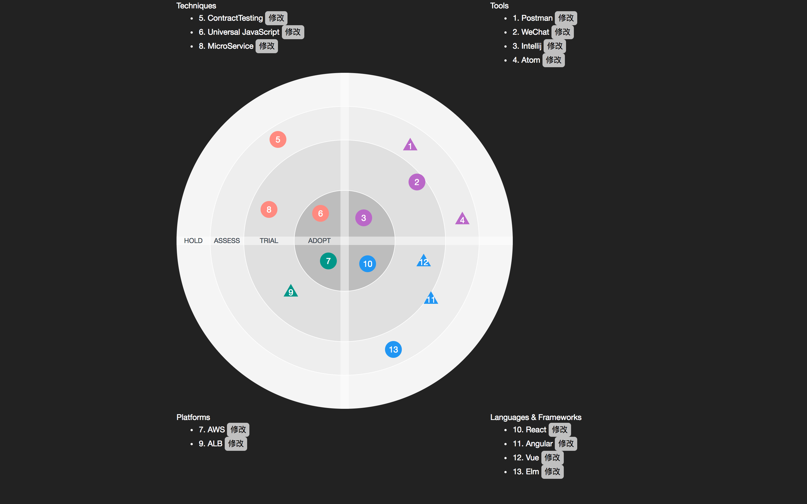

# WYSIWYG TechRadar Editor (PWA)




> built by yo with `generator-react-webpack`

```
# recommend node version >= 7.0
npm install
npm start
```

Thanks to [RxKotlin/techradar-reactjs: A tool for generating Tech-Radar in browser.](https://github.com/RxKotlin/techradar-reactjs) 
